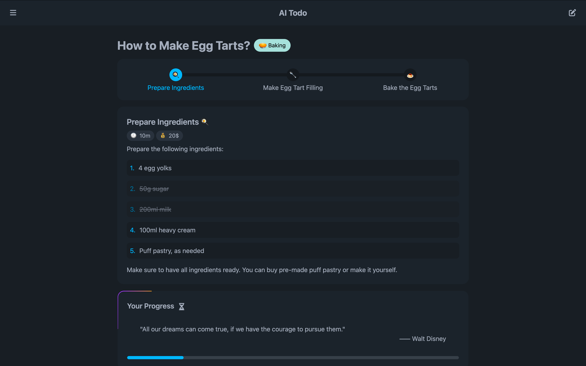

<h3 align="center">
    AI Todo - AI-Powered Task Splitting
</h3>

<p align="center">
    
    
    
    
    
</p>

<p align="center">
  
</p>

# AI Todo — Task Splitting with AI

AI Todo is an AI-powered task management tool that takes user input and breaks it down into actionable, smaller tasks. It's designed to help users tackle large tasks efficiently by automating task breakdowns and making to-do lists more manageable.

## Features
- **AI-Driven Task Breakdown**: Automatically split complex tasks into smaller, manageable steps.
- **Better Task Management**: Manage tasks more effectively with detailed cost and time estimations.
- **Intuitive Progress Tracking**: Visualize progress with task icons and progress bar for completion tracking.

## Technologies Used

- **[Svelte 5](https://svelte.dev/)**: The next-gen frontend framework for creating highly reactive user interfaces.
- **[Bun](https://bun.sh/)**: A fast JavaScript runtime, toolkit, package manger and bundler.
- **[Vite](https://vitejs.dev/)**: Fast and lightweight build tool for modern web development.
- **[Tailwind CSS](https://tailwindcss.com/)**: Utility-first CSS framework for rapid UI development.
- **[DaisyUI](https://daisyui.com/)**: Tailwind CSS-based component library to simplify UI building.
- **[Svelte Animation Components](https://animation-svelte.vercel.app/)**: Used some components for better interactive.
- **[Zod](https://zod.dev/)**: A schema validation library to handle user inputs.
- **[Markdown-it](https://markdown-it.github.io/)**: Markdown parser to easily transform user input.
- **[js-yaml](https://github.com/nodeca/js-yaml)**: Used to parse YAML data structures.

## Installation

1. Clone the repository:

   ```bash
   git clone https://github.com/remi-guan/AI-Todo.git
   cd AI-Todo
   ```

2. Install dependencies:

    ```bash
    bun install
    ```

3. Run the development server:

    ```bash
    bun dev
    ```

4. Build the project:

    ```bash
    bun build
    ```

## Contributing
Contributions are welcome! Please fork the repository and open a pull request to propose improvements or fixes.

## License
This project is licensed under the MIT License - see the LICENSE file for details.
