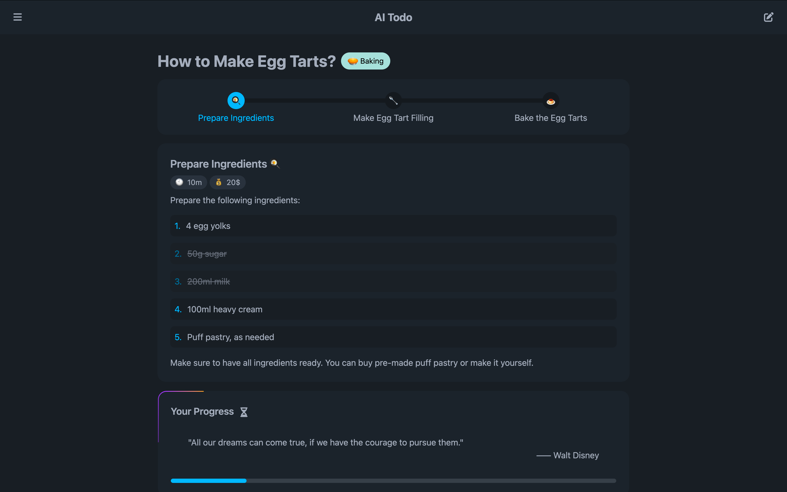

<h3 align="center">
    AI Todo - AI驱动的任务分解
</h3>

<p align="center">
    
    
    
    
    
    
</p>

<p align="center">
  
</p>

# AI Todo — AI驱动的任务分解

AI Todo 是一种由AI驱动的任务管理工具，可以将用户输入的任务分解成可执行的小任务。设计的目的是通过自动分解任务，帮助用户高效地处理大任务，使得待办事项更加可管理。

## 功能
- **AI驱动的任务分解**：自动将复杂任务分解成更小、易于管理的步骤。
- **有效的任务管理**：通过详细的成本和时间估算，更有效地管理任务。
- **相关进度跟踪**：通过任务图标和进度条来可视化地跟踪任务进度。
- **移动优先设计**：以移动优先的设计，确保在所有设备上都有极佳体验。
- **国际化支持 (i18n)**：支持接入多种语言。

## 使用的技术

- **[Svelte 5](https://svelte.dev/)**：新一代前端框架，用于高效开发用户界面。
- **[Bun](https://bun.sh/)**：一个快速的JavaScript运行时，工具集，包管理器和构建器。
- **[Drizzle ORM](https://orm.drizzle.team/)**：轻量级的TypeScript ORM.
- **[Vite](https://vitejs.dev/)**：为现代网页开发设计的快速轻量的构建工具。
- **[Tailwind CSS](https://tailwindcss.com/)**：CSS框架，用于快速的UI开发。
- **[DaisyUI](https://daisyui.com/)**：基于Tailwind CSS的组件库，用于简化UI构建。
- **[FontAwesome 5](https://fontawesome.com/)**：图标工具，提供可缩放的矢量图标，用于更好的视觉表示。
- **[Svelte Animation Components](https://animation-svelte.vercel.app/)**：用于提高交互性的组件。
- **[Zod](https://zod.dev/)**：模型验证库，用于验证AI输出。
- **[Markdown-it](https://markdown-it.github.io/)**：Markdown解析器，用于轻松地转换用户输入。
- **[js-yaml](https://github.com/nodeca/js-yaml)**：用于解析YAML数据结构。

## 安装

1. 克隆仓库：

   ```bash
   git clone https://github.com/remi-guan/AI-Todo.git
   cd AI-Todo
   ```

2. 安装依赖并初始化数据库：

    ```bash
    bun install
    bun --bun migrate
    ```

3. 运行开发服务器：

    ```bash
    bun --bun dev
    ```

4. 构建项目：

    ```bash
    bun --bun build
    ```

## 作出贡献
欢迎作出贡献！请先分支仓库，然后提交一个拉取请求来提出改动或修复。

## 版权声明
此项目授权于MIT许可证下的进行，详见LICENSE文件。